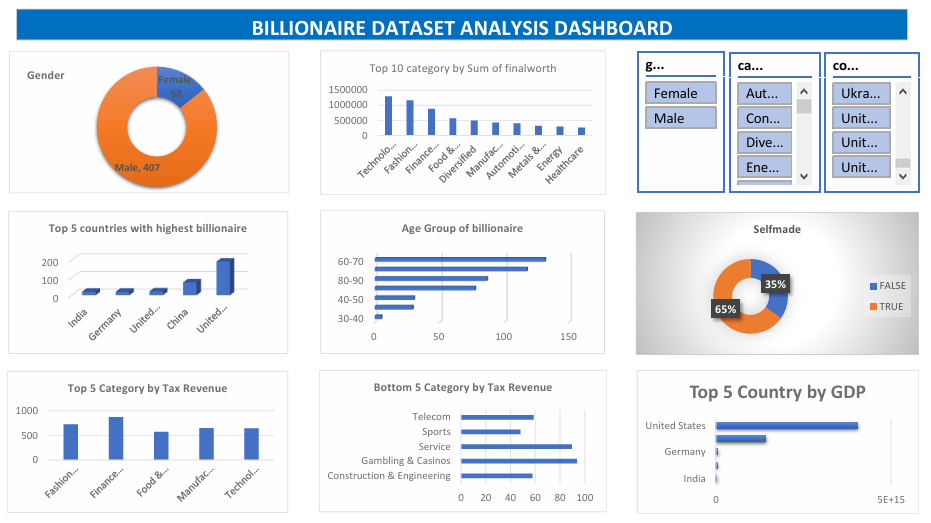

<!--Section 1: Introduce your self-->
## ABOUT ME

Hello! I'm Ejirooghene 🤓

A seasoned data analyst, virtual assistant and a cybersecurity enthusiast. I help individuals, businesses and organisations make decisions with their data. With experience across sales, operations, HR and customer service, I help businesses solve challenges and unlock growth.

<!--Mention your top/relevant skills here - core and soft skills-->
## WHAT I DO

*As a Data Analyst, I collaborate with teams to discover insights that help organisations maintain their competitive edge. I provide consulting services for businesses.*

** ✅ Data Entry.**

I help businesses and organisations collate data in a structured manner to prevent data loss.

** ✅ Data Cleaning and transformation.**

I clean and transform data using tools like Excel worksheet, functions and power query

** ✅ Data Visualisation.**

With tools like Microsoft Power Bi and Tableau, I am able to visualise insights summarily

** ✅ Report building.**
I build reports contaiing information and recommendations

** ✅ Data Analytics Consulting.**

I provide in-depth analysis and tailored solutions to help you make data-driven decisions, optimize processes, and drive business growth. 

<!--Section 2: List 3-4 key projects-->
## MY PORTFOLIO 

*A glimpse of some of the projects I've been working on.*

**Billionare Dataset Analysis.**

This dataset contains the names, demography, wealth status, fiinal worth of top rich individuals in the world.

[Read More](https://github.com/ejiro2024/Billionaire-Dataset-Project-Analysis)
 

## CONTACT DETAILS

*Let’s connect and see how we can make a difference together!*
<table>
  <tbody>
    <tr>
      <td>📧</td>
      <td><a href="mailto:ejiroogheneonofuevure@gmail.com">ejiroogheneonofuevure@gmail.com</a></td>
    </tr>
    <tr>
      <td>📞</td>
      <td>(234) 816-994-3284</td>
    </tr>
    <tr>
      <td>📍</td>
      <td>Awka, Nigeria</td>
    </tr>
    <tr>
      <td>⬇️</td>
      <td><a href="https://github.com/ejiro2024.io/portfolio1/docs/Profile.pdf">Download my CV</a></td>
    </tr>
    <tr>
      <td>🌐</td>
      <td><a href="https://linkedin.com/in/etukanietie">The things I do daily on LinkedIn</a></td>
    </tr>
    <tr>
      <td>📺</td>
      <td><a href="https://www.youtube.com/@LearnwithEtuk">Watch my tutorials on YouTube</a></td>
    </tr>
  </tbody>
</table>

   

